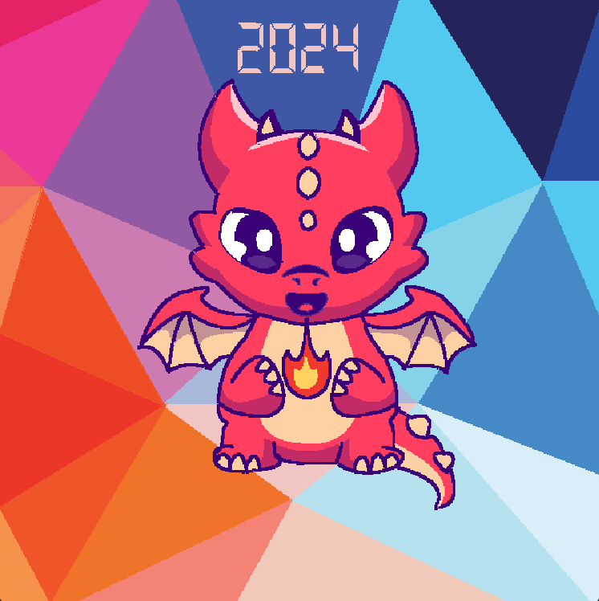

# Assignment 1: Little Dragon and the World of Colors

## Description
This project is part of our Java programming assignment where we were tasked to create a still image using Java 2D API. The image must be 600 x 600 pixels and should follow the theme **"NEW YEAR"**.  

### Key Requirements:
- **Collaborative Work**: Worked in pairs.
- **Creative Freedom**: Designed an image with lines, curves, and triangles.


### Our Work:  
**Title**: *Little Dragon and the World of Colors*  
We created a vibrant image of a baby dragon to represent the lively and joyful spirit of the New Year, utilizing shapes and colors to express creativity.

---

## Preview  
Here is the final image we created:  

  

---


## References
Our work was inspired by the following resources:
1. **Baby Dragon Concept**:  
   [Cute Baby Dragon with Fire - Freepik](https://www.freepik.com/free-vector/cute-baby-dragon-with-fire-cartoon-vector-icon-illustration-animal-nature-icon-concept-isolated_51241460.htm#page=2&query=dragon%20animation&position=4&from_view=search&track=ais&uuid=cbae2015-c6d6-4dd9-b4be-818ea19efb3e)
2. **Background Design Inspiration**:  
   [Sum of Polygon Angles - Medium](https://mysteryweevil.medium.com/javascript-algorithm-sum-of-polygon-angles-33045e231e32)
3. **Color Palette Inspiration**:  
   [Color Design Inspiration - PNGWing](https://www.pngwing.com/en/free-png-znvap)

---


## Instructions to Run
1. Clone the repository:
   ```bash
   git clone <repository-link>
   cd <repository-folder>
